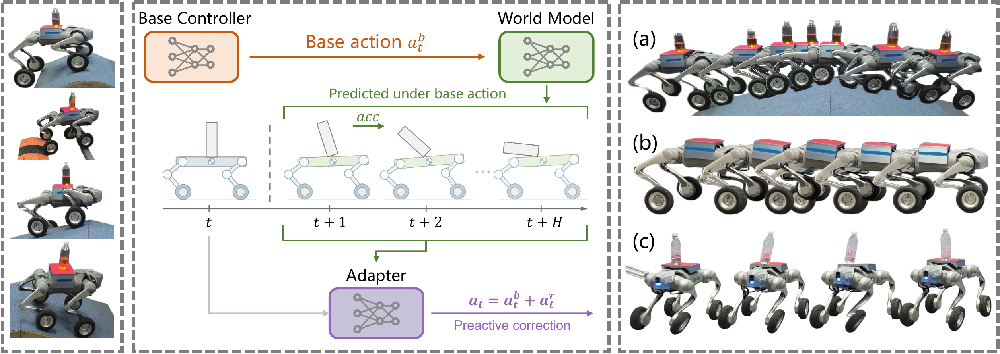

<div align="center">

### LocoWM: High-Precision Locomotion through World-Model-Guided Residual Adaptation

**CASIA**

<!-- Project Page / Paper: links to be added. -->

<p align="right">
  🌎 <a href="README.md">English</a> | <a href="README_CN.md">中文</a>
</p>

</div>

## Overview



LocoWM 让机器人在运动过程中保持精确控制。世界模型预测基础策略所提议动作的影响，残差适配器利用这些预测，在动作执行前修正预期偏差。

## 安装

环境：Python 3.11、Isaac Sim 5.1.0、Isaac Lab commit `c91a125c73`、PyTorch 2.7.0 / CUDA 12.8、RSL-RL 2.3.3。

**1. 安装仿真环境。** 从本仓库根目录执行，Isaac Lab 将克隆到同级目录。已有可用的 `isaaclab` 环境可跳至第 2 步。

```bash
conda create -n isaaclab python=3.11
conda activate isaaclab

python -m pip install "isaacsim[all,extscache]==5.1.0" \
  --extra-index-url https://pypi.nvidia.com
python -m pip install torch==2.7.0 torchvision==0.22.0 \
  --index-url https://download.pytorch.org/whl/cu128

git clone https://github.com/isaac-sim/IsaacLab.git ../IsaacLab
pushd ../IsaacLab
git checkout c91a125c73c8b574878419a9583afc0b63b99f0a
./isaaclab.sh --install none
popd
```

**2. 安装 LocoWM。**

```bash
conda activate isaaclab
python -m pip install -e .
python -m locowm.scripts.list_envs
```

下文使用 TensorBoard 记录日志。若使用 W&B 或 Neptune，先执行 `python -m pip install -e '.[logging]'`，再指定 `--logger wandb` 或 `--logger neptune`。

## 训练 LocoWM 策略

**Stage 1：基础策略与世界模型。**

```bash
python -m locowm.scripts.train \
  --task Isaac-LocomotionGo2W-v1 \
  --num_envs 4096 --headless \
  --logger tensorboard --run_name stage1
```

Checkpoint 成对保存在 `logs/rsl_rl/locomotion/<run>/`。将占位符替换为文件信息：

```bash
STAGE1_RUN="<stage1-run>"
STAGE1_ITER="<iteration>"
POLICY_CHECKPOINT="logs/rsl_rl/locomotion/${STAGE1_RUN}/model_${STAGE1_ITER}.pt"
WORLD_MODEL_CHECKPOINT="logs/rsl_rl/locomotion/${STAGE1_RUN}/world_model_${STAGE1_ITER}.pt"
```

**Stage 2：残差适配器。** 冻结 Stage 1 的策略和世界模型，训练适配器。

```bash
python -m locowm.scripts.train \
  --task Isaac-TransportGo2W-Adapter-v1 \
  --num_envs 4096 --headless \
  --logger tensorboard --run_name stage2 \
  --policy_checkpoint "$POLICY_CHECKPOINT" \
  --world_model_checkpoint "$WORLD_MODEL_CHECKPOINT"
```

Checkpoint 保存在 `logs/rsl_rl/transport_adapter/<run>/`。后续回放和评测继续使用上述 Stage 1 文件及 shell 变量。

## 回放与评测

选择 Stage 2 的 run 目录名和 checkpoint 文件名：

```bash
STAGE2_RUN="<stage2-run>"
STAGE2_CHECKPOINT="model_<iteration>.pt"
```

**策略回放。**

```bash
python -m locowm.scripts.play \
  --task Isaac-TransportGo2W-Adapter-Play-v1 --num_envs 20 \
  --load_run "$STAGE2_RUN" --checkpoint "$STAGE2_CHECKPOINT" \
  --policy_checkpoint "$POLICY_CHECKPOINT" \
  --world_model_checkpoint "$WORLD_MODEL_CHECKPOINT"
```

查看基础策略时，使用 `Isaac-LocomotionGo2W-Play-v1` 和 Stage 1 的 run/checkpoint，省略 `--policy_checkpoint` 与 `--world_model_checkpoint`。

**控制指标。** 测量四类地形、四档难度下的速度跟踪、姿态与载物表现。

```bash
python -m locowm.scripts.eval \
  --task Isaac-EvalGo2W-Adapter-v1 --num_envs 256 --headless \
  --load_run "$STAGE2_RUN" --checkpoint "$STAGE2_CHECKPOINT" \
  --policy_checkpoint "$POLICY_CHECKPOINT" \
  --world_model_checkpoint "$WORLD_MODEL_CHECKPOINT"
```

结果保存在 `logs/eval/<task>/<timestamp>/` 下的 `metrics.json` 和 `metrics.csv`。

**载物成功率。**

```bash
python -m locowm.scripts.succ_eval \
  --task Isaac-SuccGo2W-Adapter-v1 --num_envs 256 --headless \
  --load_run "$STAGE2_RUN" --checkpoint "$STAGE2_CHECKPOINT" \
  --policy_checkpoint "$POLICY_CHECKPOINT" \
  --world_model_checkpoint "$WORLD_MODEL_CHECKPOINT"
```

通过指定距离且载物未掉落计为成功；初始加速阶段的掉落重试，不计入成功或失败。结果保存在 `logs/succ_eval/<task>/<timestamp>/` 下的 `success.json` 和 `success.csv`。

## 可替代版本

**端到端运载策略。**

```bash
python -m locowm.scripts.train \
  --task Isaac-TransportGo2W-v1 \
  --num_envs 4096 --headless --logger tensorboard
```

**反应式残差。** 使用 Stage 1 基础策略，世界模型特征置零，不传入 `--world_model_checkpoint`。

```bash
python -m locowm.scripts.train \
  --task Isaac-TransportGo2W-Adapter-NoWM-v1 \
  --num_envs 4096 --headless --logger tensorboard \
  --policy_checkpoint "$POLICY_CHECKPOINT"
```

**重建式。** 将未来预测替换为当前状态重建。先训练重建版本的 Stage 1：

```bash
python -m locowm.scripts.train \
  --task Isaac-LocomotionGo2W-ReconWM-v1 \
  --num_envs 4096 --headless --logger tensorboard
```

再使用该 run 中同一迭代的策略和世界模型训练适配器：

```bash
python -m locowm.scripts.train \
  --task Isaac-TransportGo2W-Adapter-ReconWM-v1 \
  --num_envs 4096 --headless --logger tensorboard \
  --policy_checkpoint "logs/rsl_rl/locomotion_reconwm/<run>/model_<iteration>.pt" \
  --world_model_checkpoint "logs/rsl_rl/locomotion_reconwm/<run>/world_model_<iteration>.pt"
```

## 代码与研究说明

`locowm` 包含 Isaac Lab 任务和运行入口；`loco_rl` 包含世界模型、残差适配器和训练扩展，共用组件直接复用 RSL-RL。

本项目基于 [Isaac Lab](https://github.com/isaac-sim/IsaacLab)、[RSL-RL](https://github.com/leggedrobotics/rsl_rl)、[robot_lab](https://github.com/fan-ziqi/robot_lab) 和 [unitree_rl_gym](https://github.com/unitreerobotics/unitree_rl_gym)，感谢这些项目的作者与贡献者。
